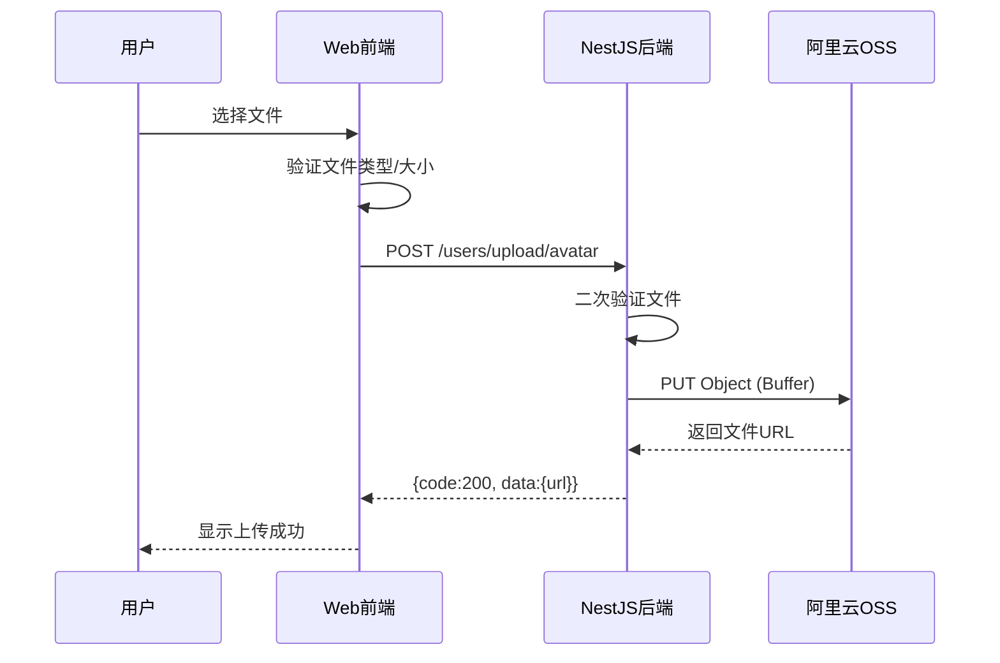
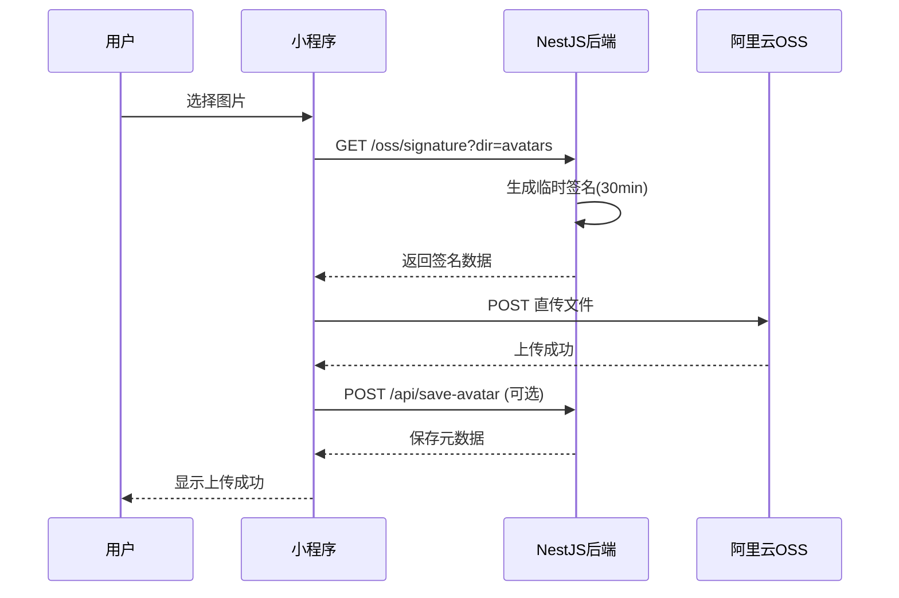

# 阿里云 OSS 混合上传架构方案

> **项目**: Campus Project - 校园综合管理系统  
> **技术栈**: NestJS + Vue3 + UniApp + 阿里云 OSS  
> **版本**: v1.0  
> **更新日期**: 2026-07-29

---

## 📋 目录

- [1. 方案概述](#1-方案概述)
- [2. 架构设计](#2-架构设计)
- [3. 环境配置](#3-环境配置)
- [4. 后端实现](#4-后端实现)
- [5. Web 管理端实现](#5-web-管理端实现)
- [6. 小程序端实现](#6-小程序端实现)
- [7. 性能优化策略](#7-性能优化策略)
- [8. 安全最佳实践](#8-安全最佳实践)
- [9. 成本优化技巧](#9-成本优化技巧)
- [10. 常见问题排查](#10-常见问题排查)

---

## 1. 方案概述

### 1.1 核心思路

采用**混合上传架构**，根据不同客户端特点选择最优上传方式：

| 客户端           | 上传方式       | 适用场景                | 优势               |
| ---------------- | -------------- | ----------------------- | ------------------ |
| **Web 管理后台** | 服务端代理上传 | 头像、小图标（<5MB）    | 实现简单、安全性高 |
| **小程序端**     | 客户端直传 OSS | 商品图、轮播图（<10MB） | 节省带宽、速度快   |

### 1.2 技术选型

```
┌─────────────────────────────────────────────┐
│           前端应用层                         │
│  ┌──────────┐        ┌──────────────────┐   │
│  │ Web管理端 │        │   小程序端       │   │
│  │(Vue3+EP) │        │ (UniApp+Vue3)    │   │
│  └────┬─────┘        └────────┬─────────┘   │
│       │                       │              │
│  代理上传模式            直传签名模式         │
└───────┼───────────────────────┼──────────────┘
        │ HTTP Request          │ GET /oss/signature
        ▼                       ▼
┌─────────────────────────────────────────────┐
│         API Gateway (NestJS)                 │
│  ┌──────────────┐    ┌──────────────────┐   │
│  │ POST /upload  │    │ GET /signature   │   │
│  │  (代理上传)   │    │  (获取签名)      │   │
│  └──────┬───────┘    └────────┬─────────┘   │
└─────────┼─────────────────────┼──────────────┘
          │                     │
          │ Buffer             返回签名数据
          ▼                     │
┌──────────────────────────────┼──────────────┐
│      阿里云 OSS SDK          │              │
│  ┌───────────────────────────┴──────────┐   │
│  │  PUT Object (服务端上传)             │   │
│  │  Generate Signature (生成签名)       │   │
│  └──────────────────┬───────────────────┘   │
└─────────────────────┼───────────────────────┘
                      │
                      ▼
┌─────────────────────────────────────────────┐
│        阿里云 OSS 存储桶                     │
│  Region: oss-cn-hangzhou                    │
│  Bucket: campus-project-oss                 │
│  CDN: cdn.yourdomain.com                    │
└─────────────────────────────────────────────┘
```

### 1.3 核心依赖

```json
{
  "dependencies": {
    "ali-oss": "^6.18.0",
    "@types/ali-oss": "^6.16.0"
  }
}
```

---

## 2. 架构设计

### 2.1 服务端代理上传流程（Web 管理端）



**优点**：

- ✅ 前端无需暴露 OSS AccessKey
- ✅ 后端可统一进行文件审核和元数据管理
- ✅ 适合小文件（<5MB），用户体验好

**缺点**：

- ❌ 占用服务器带宽和 CPU
- ❌ 大文件上传速度慢

---

### 2.2 客户端直传流程（小程序端）



**优点**：

- ✅ 不占用服务器带宽
- ✅ 上传速度快（直连 OSS）
- ✅ 支持大文件（<10MB）
- ✅ 临时签名，安全性高

**缺点**：

- ❌ 前端需处理签名过期逻辑
- ❌ 需要额外的元数据保存接口

---

## 3. 环境配置

### 3.1 阿里云 OSS 控制台配置

#### 步骤 1：创建 Bucket

1. 登录 [阿里云 OSS 控制台](https://oss.console.aliyun.com/)
2. 点击「创建 Bucket」
3. 配置参数：
   - **Bucket 名称**: `gzd-campus-oss`（全局唯一）
   - **地域**: 华东1（杭州）`oss-cn-beijing`
   - **存储类型**: 标准存储
   - **读写权限**: **私有**（重要！）
   - **版本控制**: 不开启
   - **服务端加密**: 不开启

#### 步骤 2：配置 CORS

进入 Bucket → 「基础设置」→ 「跨域设置」→ 「创建规则」

```json
{
  "来源": "*",
  "允许 Methods": ["GET", "POST", "PUT", "DELETE", "HEAD"],
  "允许 Headers": ["*"],
  "暴露 Headers": ["ETag", "x-oss-request-id"],
  "缓存时间": 600
}
```

#### 步骤 3：配置 CDN（可选但推荐）

1. 开通阿里云 CDN 服务
2. 添加域名：`static.tyhfcampus.com`
3. 源站类型：OSS 域名
4. 回源协议：HTTPS
5. 缓存配置：
   - 图片文件（.jpg/.png/.gif）：缓存 7 天
   - 其他文件：缓存 1 小时

#### 步骤 4：获取 AccessKey

1. 进入 [RAM 访问控制](https://ram.console.aliyun.com/)
2. 创建用户并生成 AccessKey
3. **强烈建议**：为该用户绑定最小权限策略

```json
{
  "Version": "1",
  "Statement": [
    {
      "Effect": "Allow",
      "Action": ["oss:PutObject", "oss:GetObject", "oss:DeleteObject"],
      "Resource": ["acs:oss:*:*:campus-project-oss/*"]
    }
  ]
}
```

---

### 3.2 项目环境变量配置

创建 `.env` 文件（根目录或 `apps/backend/.env`）：

```bash
# ==================== 阿里云 OSS 配置 ====================

# OSS 区域（根据实际选择的区域填写）
OSS_REGION=oss-cn-hangzhou

# AccessKey ID（从 RAM 控制台获取）
OSS_ACCESS_KEY_ID=LTAI5tXXXXXXXXXXXXXXXX

# AccessKey Secret（妥善保管，不要泄露）
OSS_ACCESS_KEY_SECRET=xxxxxxxxxxxxxxxxxxxxxxxxxxxxxx

# Bucket 名称
OSS_BUCKET=campus-project-oss

# CDN 加速域名（可选，未配置则使用 OSS 默认域名）
OSS_CDN_DOMAIN=https://cdn.yourdomain.com

# ==================== 上传限制配置 ====================

# 代理上传最大文件大小（字节）- 5MB
PROXY_UPLOAD_MAX_SIZE=5242880

# 直传签名有效期（秒）- 30分钟
OSS_SIGNATURE_EXPIRE=1800

# 直传最大文件大小（字节）- 10MB
DIRECT_UPLOAD_MAX_SIZE=10485760
```

**⚠️ 安全提醒**：

- `.env` 文件必须加入 `.gitignore`
- 生产环境通过 CI/CD 注入环境变量
- 定期轮换 AccessKey

---

## 4. 后端实现

### 4.1 目录结构

```
apps/backend/src/
├── common/
│   ├── configs/
│   │   └── oss.config.ts          # OSS 配置模块
│   └── services/
│       ├── oss.service.ts         # OSS 服务封装
│       └── oss.module.ts          # OSS 模块
├── users/
│   ├── users.upload.controller.ts # 上传控制器（代理模式）
│   └── users.module.ts
└── auth/
    └── auth.oss.controller.ts     # 签名控制器（直传模式）
```

---

### 4.2 OSS 配置模块

**文件**: `apps/backend/src/common/configs/oss.config.ts`

```typescript
import { registerAs } from '@nestjs/config'

/**
 * OSS 配置注册函数
 * 从环境变量读取 OSS 相关配置
 */
export default registerAs('oss', () => ({
  // OSS 区域 endpoint
  region: process.env.OSS_REGION || 'oss-cn-hangzhou',

  // AccessKey ID
  accessKeyId: process.env.OSS_ACCESS_KEY_ID,

  // AccessKey Secret
  accessKeySecret: process.env.OSS_ACCESS_KEY_SECRET,

  // Bucket 名称
  bucket: process.env.OSS_BUCKET,

  // CDN 加速域名（可选）
  cdnDomain: process.env.OSS_CDN_DOMAIN || '',

  // 签名有效期（秒）
  signatureExpire: parseInt(process.env.OSS_SIGNATURE_EXPIRE || '1800', 10),

  // 代理上传最大文件大小（字节）
  proxyMaxSize: parseInt(process.env.PROXY_UPLOAD_MAX_SIZE || '5242880', 10),

  // 直传最大文件大小（字节）
  directMaxSize: parseInt(process.env.DIRECT_UPLOAD_MAX_SIZE || '10485760', 10),
}))
```

---

### 4.3 OSS 服务封装

**文件**: `apps/backend/src/common/services/oss.service.ts`

```typescript
import { Injectable, Inject } from '@nestjs/common'
import { ConfigType } from '@nestjs/config'
import OSS from 'ali-oss'
import ossConfig from '../configs/oss.config'

/**
 * OSS 服务类
 * 封装阿里云 OSS 的常用操作
 */
@Injectable()
export class OssService {
  private client: OSS

  constructor(
    @Inject(ossConfig.KEY)
    private config: ConfigType<typeof ossConfig>
  ) {
    // 初始化 OSS 客户端
    this.client = new OSS({
      region: this.config.region,
      accessKeyId: this.config.accessKeyId,
      accessKeySecret: this.config.accessKeySecret,
      bucket: this.config.bucket,
    })
  }

  /**
   * 上传文件到 OSS（服务端代理模式）
   * @param file - 文件 Buffer
   * @param fileName - 文件名（包含路径）
   * @returns OSS 文件完整 URL
   */
  async uploadFile(file: Buffer, fileName: string): Promise<string> {
    try {
      const result = await this.client.put(fileName, file)

      // 如果配置了 CDN，返回 CDN 地址
      if (this.config.cdnDomain) {
        return `${this.config.cdnDomain}/${fileName}`
      }

      // 否则返回 OSS 默认地址
      return result.url
    } catch (error) {
      throw new Error(`OSS 上传失败: ${error.message}`)
    }
  }

  /**
   * 生成唯一文件名
   * 格式: uploads/timestamp_randomString.ext
   * @param originalName - 原始文件名
   * @param dir - 目录前缀（默认 uploads）
   * @returns 唯一文件名
   */
  generateFileName(originalName: string, dir: string = 'uploads'): string {
    const timestamp = Date.now()
    const randomStr = Math.random().toString(36).substring(2, 8)
    const ext = originalName.split('.').pop()?.toLowerCase() || 'bin'
    return `${dir}/${timestamp}_${randomStr}.${ext}`
  }

  /**
   * 生成 OSS 直传签名（客户端直传模式）
   * @param dir - 上传目录前缀
   * @returns 签名信息对象
   */
  getSignature(dir: string = 'uploads') {
    const now = Date.now()
    const expire = this.config.signatureExpire // 默认 30 分钟

    // 构建 Policy 策略
    const policyText = {
      expiration: new Date(now + expire * 1000).toISOString(),
      conditions: [
        // 限制文件大小
        ['content-length-range', 0, this.config.directMaxSize],
        // 限制上传目录
        ['starts-with', '$key', dir + '/'],
      ],
    }

    // Base64 编码 Policy
    const policy = Buffer.from(JSON.stringify(policyText)).toString('base64')

    // 计算签名
    const signature = this.client.calculatePostSignature(policyText)

    // 构造 OSS Host
    const host = `https://${this.config.bucket}.${this.config.region}.aliyuncs.com`

    return {
      code: 200,
      message: 'success',
      data: {
        accessKeyId: this.config.accessKeyId,
        policy,
        signature,
        dir,
        host,
        expire: now + expire * 1000, // 过期时间戳
      },
    }
  }

  /**
   * 删除 OSS 文件
   * @param fileName - 文件名（包含路径）
   */
  async deleteFile(fileName: string): Promise<void> {
    try {
      await this.client.delete(fileName)
    } catch (error) {
      throw new Error(`OSS 删除失败: ${error.message}`)
    }
  }
}
```

---

### 4.4 OSS 模块注册

**文件**: `apps/backend/src/common/services/oss.module.ts`

```typescript
import { Module } from '@nestjs/common'
import { ConfigModule } from '@nestjs/config'
import { OssService } from './oss.service'
import ossConfig from '../configs/oss.config'

@Module({
  imports: [ConfigModule.forFeature(ossConfig)],
  providers: [OssService],
  exports: [OssService], // 导出供其他模块使用
})
export class OssModule {}
```

在 `AppModule` 中导入：

```typescript
// apps/backend/src/app.module.ts
import { Module } from '@nestjs/common'
import { OssModule } from './common/services/oss.module'

@Module({
  imports: [
    // ... 其他模块
    OssModule,
  ],
})
export class AppModule {}
```

---

### 4.5 代理上传控制器（Web 管理端）

**文件**: `apps/backend/src/users/users.upload.controller.ts`

```typescript
import {
  Controller,
  Post,
  UseInterceptors,
  UploadedFile,
  BadRequestException,
} from '@nestjs/common'
import { FileInterceptor } from '@nestjs/platform-express'
import { OssService } from '../common/services/oss.service'
import { ApiTags, ApiOperation, ApiConsumes, ApiBody } from '@nestjs/swagger'

@ApiTags('用户管理-文件上传')
@Controller('users')
export class UsersUploadController {
  constructor(private readonly ossService: OssService) {}

  /**
   * 上传头像到 OSS（代理模式）
   * @param file - 上传的文件
   * @returns 文件 URL
   */
  @Post('upload/avatar')
  @UseInterceptors(FileInterceptor('file'))
  @ApiConsumes('multipart/form-data')
  @ApiOperation({ summary: '上传头像到 OSS' })
  @ApiBody({
    schema: {
      type: 'object',
      properties: {
        file: {
          type: 'string',
          format: 'binary',
        },
      },
    },
  })
  async uploadAvatar(@UploadedFile() file: Express.Multer.File) {
    // 1. 验证文件是否存在
    if (!file) {
      throw new BadRequestException('请选择要上传的文件')
    }

    // 2. 验证文件类型（只允许图片）
    if (!file.mimetype.startsWith('image/')) {
      throw new BadRequestException('只支持图片文件')
    }

    // 3. 验证文件大小（限制 5MB）
    const maxSize = 5 * 1024 * 1024
    if (file.size > maxSize) {
      throw new BadRequestException('图片大小不能超过 5MB')
    }

    // 4. 生成唯一文件名
    const fileName = this.ossService.generateFileName(file.originalname, 'avatars')

    // 5. 上传到 OSS
    const url = await this.ossService.uploadFile(file.buffer, fileName)

    // 6. 返回结果
    return {
      code: 200,
      message: '上传成功',
      data: {
        url,
        fileName,
        size: file.size,
      },
    }
  }
}
```

在 `UsersModule` 中注册控制器：

```typescript
// apps/backend/src/users/users.module.ts
import { Module } from '@nestjs/common'
import { UsersUploadController } from './users.upload.controller'
import { OssModule } from '../common/services/oss.module'

@Module({
  imports: [OssModule],
  controllers: [UsersUploadController],
  // ... 其他配置
})
export class UsersModule {}
```

---

### 4.6 签名控制器（小程序直传）

**文件**: `apps/backend/src/auth/auth.oss.controller.ts`

```typescript
import { Controller, Get, Query, UseGuards } from '@nestjs/common'
import { OssService } from '../common/services/oss.service'
import { ApiTags, ApiOperation, ApiQuery } from '@nestjs/swagger'
import { AuthGuard } from './guard/auth.guard'

@ApiTags('文件上传-签名')
@Controller('oss')
@UseGuards(AuthGuard) // 需要登录才能获取签名
export class OssSignatureController {
  constructor(private readonly ossService: OssService) {}

  /**
   * 获取 OSS 直传签名
   * @param dir - 上传目录（avatars/goods/posts）
   * @returns 签名数据
   */
  @Get('signature')
  @ApiOperation({ summary: '获取 OSS 直传签名' })
  @ApiQuery({
    name: 'dir',
    required: false,
    description: '上传目录前缀',
    example: 'avatars',
  })
  getSignature(@Query('dir') dir: string = 'uploads') {
    // 验证目录合法性（防止任意目录上传）
    const allowedDirs = ['avatars', 'goods', 'posts', 'uploads']
    if (!allowedDirs.includes(dir)) {
      dir = 'uploads' // 默认目录
    }

    return this.ossService.getSignature(dir)
  }
}
```

---

## 5. Web 管理端实现

### 5.1 API 封装

**文件**: `apps/frontend/src/api/userManagement/upload.ts`

```typescript
import http from '@/api/http'

/**
 * 上传头像到 OSS（代理模式）
 * @param file - 文件对象
 * @returns 上传结果
 */
export const uploadAvatar = (file: File) => {
  const formData = new FormData()
  formData.append('file', file)

  return http.post('/users/upload/avatar', formData, {
    headers: {
      'Content-Type': 'multipart/form-data',
    },
  })
}
```

---

### 5.2 注册弹窗集成上传

**文件**: `apps/frontend/src/views/userManagement/userList/RegisterDialog.vue`

```vue
<template>
  <el-form ref="registerForm" label-width="80px">
    <!-- 登录账号 -->
    <el-form-item label="登录账号">
      <el-input v-model="registerData.loginKey" placeholder="请输入登录账号" />
    </el-form-item>

    <!-- 昵称 -->
    <el-form-item label="昵称">
      <el-input v-model="registerData.nickname" placeholder="请输入昵称" />
    </el-form-item>

    <!-- 头像上传 -->
    <el-form-item label="头像">
      <el-upload
        class="avatar-uploader"
        action="#"
        :show-file-list="false"
        :before-upload="beforeUpload"
        :http-request="handleUpload"
      >
        
        <el-icon v-else class="avatar-uploader-icon"><Plus /></el-icon>
      </el-upload>
      <div class="upload-tip">支持 JPG/PNG/GIF，不超过 5MB</div>
    </el-form-item>

    <!-- 邮箱 -->
    <el-form-item label="邮箱">
      <el-input v-model="registerData.email" placeholder="请输入邮箱（可选）" clearable />
    </el-form-item>

    <!-- 角色 -->
    <el-form-item label="角色">
      <el-select v-model="registerData.role" placeholder="请选择角色" style="width: 100%">
        <el-option
          v-for="item in roleOptions"
          :key="item.value"
          :label="item.label"
          :value="item.value"
        />
      </el-select>
    </el-form-item>

    <!-- 密码 -->
    <el-form-item label="密码">
      <el-input
        v-model="registerData.password"
        type="password"
        placeholder="请输入密码"
        show-password
      />
    </el-form-item>

    <!-- 按钮区域 -->
    <div class="dialog-button">
      <el-button type="primary" @click="handleSubmit">提交</el-button>
      <el-button @click="emit('closeDialog')">取消</el-button>
    </div>
  </el-form>
</template>

<script setup lang="ts">
import type { registerVO } from '@campus/types'
import { UserRole } from '@campus/types'
import { uploadAvatar } from '@/api/userManagement/upload'
import type { UploadRawFile } from 'element-plus'

/**
 * 表单引用
 */
const registerForm = ref()

/**
 * 注册表单数据
 */
const registerData = ref<registerVO>({
  loginKey: '',
  nickname: '',
  avatar: null,
  email: null,
  role: UserRole.STUDENT,
  password: '',
})

/**
 * 角色选项列表
 */
const roleOptions = [
  { label: '管理员', value: UserRole.ADMIN },
  { label: '审核员', value: UserRole.AUDITOR },
  { label: '用户', value: UserRole.STUDENT },
]

/**
 * 定义组件事件
 */
const emit = defineEmits<{
  submitRequest: [data: registerVO]
  closeDialog: []
}>()

/**
 * 上传前验证
 * @param file - 待上传文件
 * @returns 是否允许上传
 */
const beforeUpload = (file: UploadRawFile) => {
  const isImage = file.type.startsWith('image/')
  const isLt5M = file.size / 1024 / 1024 < 5

  if (!isImage) {
    ElMessage.error('只能上传图片文件（JPG/PNG/GIF）!')
    return false
  }
  if (!isLt5M) {
    ElMessage.error('图片大小不能超过 5MB!')
    return false
  }
  return true
}

/**
 * 自定义上传处理（代理模式）
 * @param options - 上传选项
 */
const handleUpload = async (options: any) => {
  try {
    const res = await uploadAvatar(options.file)
    registerData.value.avatar = res.url
    ElMessage.success('上传成功')
  } catch (error) {
    ElMessage.error('上传失败')
  }
}

/**
 * 处理提交操作
 */
const handleSubmit = () => {
  emit('submitRequest', registerData.value)
}
</script>

<style lang="scss" scoped>
.avatar-uploader {
  border: 1px dashed #d9d9d9;
  border-radius: 6px;
  cursor: pointer;
  position: relative;
  overflow: hidden;
  width: 100px;
  height: 100px;

  &:hover {
    border-color: #409eff;
  }
}

.avatar-uploader-icon {
  font-size: 28px;
  color: #8c939d;
  width: 100px;
  height: 100px;
  text-align: center;
  line-height: 100px;
}

.avatar {
  width: 100px;
  height: 100px;
  display: block;
  object-fit: cover;
}

.upload-tip {
  font-size: 12px;
  color: #999;
  margin-top: 8px;
}

.dialog-button {
  text-align: right;
}
</style>
```

---

## 6. 小程序端实现

### 6.1 OSS 上传工具封装

**文件**: `apps/applet/src/utils/oss-upload.ts`

```typescript
interface OssSignature {
  accessKeyId: string
  policy: string
  signature: string
  dir: string
  host: string
  expire: number
}

/**
 * 获取 OSS 签名
 * @param dir - 上传目录前缀
 * @returns 签名数据
 */
export const getOssSignature = async (dir: string = 'uploads'): Promise<OssSignature> => {
  const res = await uni.request({
    url: '/oss/signature',
    method: 'GET',
    data: { dir },
  })

  if (res.data.code === 200) {
    return res.data.data
  }
  throw new Error('获取签名失败')
}

/**
 * 生成唯一文件名
 * @param originalName - 原始文件名
 * @returns 唯一文件名
 */
const generateFileName = (originalName: string): string => {
  const timestamp = Date.now()
  const randomStr = Math.random().toString(36).substring(2, 8)
  const ext = originalName.split('.').pop() || 'jpg'
  return `${timestamp}_${randomStr}.${ext}`
}

/**
 * 直传文件到 OSS
 * @param filePath - 本地文件路径
 * @param dir - 上传目录
 * @returns OSS 文件 URL
 */
export const uploadToOss = async (filePath: string, dir: string = 'uploads'): Promise<string> => {
  try {
    // 1. 获取签名
    const signature = await getOssSignature(dir)

    // 2. 检查签名是否过期
    if (Date.now() > signature.expire) {
      throw new Error('签名已过期，请重新获取')
    }

    // 3. 生成文件名
    const fileName = generateFileName(filePath.split('/').pop() || 'file.jpg')
    const key = `${signature.dir}/${fileName}`

    // 4. 上传到 OSS
    return new Promise((resolve, reject) => {
      uni.uploadFile({
        url: signature.host,
        filePath,
        name: 'file',
        formData: {
          key,
          policy: signature.policy,
          OSSAccessKeyId: signature.accessKeyId,
          signature: signature.signature,
          success_action_status: '200',
        },
        success: (res) => {
          if (res.statusCode === 200) {
            // 上传成功，返回文件 URL
            const fileUrl = `${signature.host}/${key}`
            resolve(fileUrl)
          } else {
            reject(new Error(`上传失败: ${res.statusCode}`))
          }
        },
        fail: (err) => {
          reject(err)
        },
      })
    })
  } catch (error) {
    console.error('OSS 上传失败:', error)
    throw error
  }
}
```

---

### 6.2 用户资料编辑页面

**文件**: `apps/applet/src/pages/mine/edit.vue`

```vue
<template>
  <view class="edit-page">
    <!-- 头像区域 -->
    <view class="avatar-section">
      <image
        :src="userInfo.avatar || '/static/default-avatar.png'"
        class="avatar"
        mode="aspectFill"
        @click="chooseAvatar"
      />
      <text class="tip">点击更换头像</text>
    </view>

    <!-- 昵称输入 -->
    <view class="form-item">
      <text class="label">昵称</text>
      <input v-model="userInfo.nickname" class="input" placeholder="请输入昵称" maxlength="20" />
    </view>

    <!-- 保存按钮 -->
    <button class="save-btn" @click="saveProfile">保存</button>
  </view>
</template>

<script setup lang="ts">
import { uploadToOss } from '@/utils/oss-upload'

const userInfo = ref({
  avatar: '',
  nickname: '',
})

/**
 * 选择并上传头像
 */
const chooseAvatar = async () => {
  try {
    // 1. 选择图片
    const res = await uni.chooseImage({
      count: 1,
      sizeType: ['compressed'], // 压缩图，减小体积
      sourceType: ['album', 'camera'],
    })

    const tempFilePath = res.tempFilePaths[0]

    // 2. 显示加载提示
    uni.showLoading({ title: '上传中...' })

    // 3. 直传 OSS
    const avatarUrl = await uploadToOss(tempFilePath, 'avatars')

    // 4. 更新本地数据
    userInfo.value.avatar = avatarUrl

    uni.hideLoading()
    uni.showToast({ title: '上传成功', icon: 'success' })
  } catch (error) {
    uni.hideLoading()
    uni.showToast({ title: '上传失败', icon: 'error' })
  }
}

/**
 * 保存用户资料
 */
const saveProfile = async () => {
  try {
    uni.showLoading({ title: '保存中...' })

    // TODO: 调用后端 API 保存用户信息
    // await updateUserInfo(userInfo.value)

    uni.hideLoading()
    uni.showToast({ title: '保存成功', icon: 'success' })

    // 返回上一页
    setTimeout(() => {
      uni.navigateBack()
    }, 1500)
  } catch (error) {
    uni.hideLoading()
    uni.showToast({ title: '保存失败', icon: 'error' })
  }
}
</script>

<style lang="scss" scoped>
.edit-page {
  padding: 20px;
}

.avatar-section {
  display: flex;
  flex-direction: column;
  align-items: center;
  margin-bottom: 30px;

  .avatar {
    width: 100px;
    height: 100px;
    border-radius: 50%;
    border: 2px solid #eee;
  }

  .tip {
    margin-top: 10px;
    font-size: 14px;
    color: #999;
  }
}

.form-item {
  margin-bottom: 20px;

  .label {
    display: block;
    margin-bottom: 8px;
    font-size: 14px;
    color: #333;
  }

  .input {
    width: 100%;
    padding: 10px;
    border: 1px solid #ddd;
    border-radius: 4px;
    font-size: 14px;
  }
}

.save-btn {
  margin-top: 30px;
  background-color: #07c160;
  color: white;
  border: none;
  border-radius: 4px;
  padding: 12px;
  font-size: 16px;
}
</style>
```

---

### 6.3 商品发布页面（多图上传示例）

**文件**: `apps/applet/src/pages/goods/publish.vue`

```vue
<template>
  <view class="publish-page">
    <!-- 商品图片上传 -->
    <view class="images-section">
      <text class="section-title">商品图片（最多5张）</text>
      <view class="images-grid">
        <view v-for="(img, index) in imageList" :key="index" class="image-item">
          <image :src="img" mode="aspectFill" class="thumb" />
          <view class="delete-btn" @click="removeImage(index)">×</view>
        </view>

        <!-- 添加按钮 -->
        <view v-if="imageList.length < 5" class="add-btn" @click="chooseImages">
          <text>+</text>
        </view>
      </view>
    </view>

    <!-- 其他表单项... -->

    <button class="submit-btn" @click="submitGoods">发布商品</button>
  </view>
</template>

<script setup lang="ts">
import { uploadToOss } from '@/utils/oss-upload'

const imageList = ref<string[]>([])

/**
 * 选择多张图片并上传
 */
const chooseImages = async () => {
  try {
    const remainCount = 5 - imageList.value.length

    const res = await uni.chooseImage({
      count: remainCount,
      sizeType: ['compressed'],
      sourceType: ['album', 'camera'],
    })

    uni.showLoading({ title: `上传中 0/${res.tempFilePaths.length}` })

    // 并发上传所有图片
    const uploadPromises = res.tempFilePaths.map(async (path, index) => {
      const url = await uploadToOss(path, 'goods')
      return url
    })

    const urls = await Promise.all(uploadPromises)
    imageList.value.push(...urls)

    uni.hideLoading()
    uni.showToast({ title: '上传成功', icon: 'success' })
  } catch (error) {
    uni.hideLoading()
    uni.showToast({ title: '上传失败', icon: 'error' })
  }
}

/**
 * 删除图片
 */
const removeImage = (index: number) => {
  imageList.value.splice(index, 1)
}

/**
 * 提交商品
 */
const submitGoods = async () => {
  if (imageList.value.length === 0) {
    uni.showToast({ title: '请至少上传一张图片', icon: 'none' })
    return
  }

  // TODO: 提交商品信息
}
</script>
```

---

## 7. 性能优化策略

### 7.1 图片压缩

#### 前端压缩（推荐）

```typescript
/**
 * 压缩图片
 * @param file - 原始文件
 * @param maxWidth - 最大宽度
 * @param quality - 质量（0-1）
 * @returns 压缩后的 Blob
 */
export const compressImage = (
  file: File,
  maxWidth: number = 800,
  quality: number = 0.8
): Promise<Blob> => {
  return new Promise((resolve) => {
    const reader = new FileReader()
    reader.readAsDataURL(file)
    reader.onload = (e) => {
      const img = new Image()
      img.src = e.target?.result as string
      img.onload = () => {
        const canvas = document.createElement('canvas')
        let width = img.width
        let height = img.height

        // 等比例缩放
        if (width > maxWidth) {
          height = (maxWidth / width) * height
          width = maxWidth
        }

        canvas.width = width
        canvas.height = height

        const ctx = canvas.getContext('2d')
        ctx?.drawImage(img, 0, 0, width, height)

        canvas.toBlob(
          (blob) => {
            resolve(blob!)
          },
          'image/jpeg',
          quality
        )
      }
    }
  })
}
```

#### 小程序压缩

```typescript
// uni-app 自带压缩
uni.compressImage({
  src: tempFilePath,
  quality: 80, // 压缩质量 0-100
  success: (res) => {
    uploadToOss(res.tempFilePath, 'avatars')
  },
})
```

---

### 7.2 分片上传（大文件）

```typescript
/**
 * 分片上传大文件
 * @param file - 文件对象
 * @param chunkSize - 分片大小（默认 5MB）
 */
export const multipartUpload = async (file: File, chunkSize: number = 5 * 1024 * 1024) => {
  const chunks = Math.ceil(file.size / chunkSize)

  // 1. 初始化分片上传
  const uploadId = await initMultipartUpload(file.name)

  // 2. 并发上传分片（最多 3 个并发）
  const uploadedParts = []
  for (let i = 0; i < chunks; i++) {
    const start = i * chunkSize
    const end = Math.min(start + chunkSize, file.size)
    const chunk = file.slice(start, end)

    const partUrl = await uploadPart(uploadId, i + 1, chunk)
    uploadedParts.push({ PartNumber: i + 1, ETag: partUrl.etag })

    // 更新进度
    updateProgress(((i + 1) / chunks) * 100)
  }

  // 3. 完成上传
  return completeMultipartUpload(uploadId, uploadedParts)
}
```

---

### 7.3 CDN 缓存策略

在阿里云 CDN 控制台配置缓存规则：

| 文件类型               | 缓存时间 | 说明           |
| ---------------------- | -------- | -------------- |
| `.jpg/.jpeg/.png/.gif` | 7 天     | 图片长期缓存   |
| `.webp`                | 7 天     | WebP 格式      |
| `/avatars/*`           | 1 小时   | 头像频繁更新   |
| `/goods/*`             | 3 天     | 商品图中等频率 |
| 其他                   | 1 小时   | 默认缓存       |

**强制刷新 CDN 缓存**：

```typescript
// 更新头像后刷新 CDN
await refreshCdnCache([newAvatarUrl])
```

---

### 7.4 懒加载与缩略图

```vue
<!-- 列表页使用缩略图 -->
<image :src="getThumbnailUrl(item.image, 200)" mode="aspectFill" lazy-load />

<!-- 详情页使用原图 -->
<image :src="item.image" mode="widthFix" />
```

```typescript
/**
 * 生成缩略图 URL
 * @param url - 原图 URL
 * @param width - 缩略图宽度
 */
export const getThumbnailUrl = (url: string, width: number = 200) => {
  // 阿里云 OSS 图片处理参数
  return `${url}?x-oss-process=image/resize,w_${width}`
}
```

---

## 8. 安全最佳实践

### 8.1 STS 临时凭证（高级安全）

相比直接使用 AccessKey，STS 更安全：

```typescript
import { STSClient, AssumeRoleCommand } from '@aws-sdk/client-sts'

/**
 * 获取 STS 临时凭证
 */
async function getStsCredentials(userId: number) {
  const sts = new STSClient({ region: 'cn-hangzhou' })

  const command = new AssumeRoleCommand({
    RoleArn: 'acs:ram::123456789:role/oss-upload-role',
    RoleSessionName: `user-${userId}`,
    DurationSeconds: 900, // 15 分钟
    Policy: JSON.stringify({
      Statement: [
        {
          Effect: 'Allow',
          Action: ['oss:PutObject'],
          Resource: [`acs:oss:*:*:campus-project-oss/avatars/*`],
        },
      ],
    }),
  })

  const result = await sts.send(command)
  return {
    accessKeyId: result.Credentials.AccessKeyId,
    secretAccessKey: result.Credentials.SecretAccessKey,
    securityToken: result.Credentials.SecurityToken,
    expiration: result.Credentials.Expiration,
  }
}
```

---

### 8.2 文件类型白名单

```typescript
const ALLOWED_MIME_TYPES = ['image/jpeg', 'image/png', 'image/gif', 'image/webp']

const ALLOWED_EXTENSIONS = ['jpg', 'jpeg', 'png', 'gif', 'webp']

/**
 * 验证文件类型
 */
function validateFileType(file: Express.Multer.File) {
  // 检查 MIME Type
  if (!ALLOWED_MIME_TYPES.includes(file.mimetype)) {
    throw new BadRequestException('不支持的文件类型')
  }

  // 检查扩展名
  const ext = file.originalname.split('.').pop()?.toLowerCase()
  if (!ALLOWED_EXTENSIONS.includes(ext || '')) {
    throw new BadRequestException('不支持的文件格式')
  }
}
```

---

### 8.3 内容审核（AI 鉴黄）

配置 OSS 事件通知触发函数计算：

```typescript
// 阿里云函数计算
exports.handler = async (event) => {
  const imageUrl = extractImageUrl(event)

  // 调用阿里云内容安全 API
  const greenClient = new GreenClient({
    accessKeyId: process.env.ACCESS_KEY_ID,
    accessKeySecret: process.env.ACCESS_KEY_SECRET,
  })

  const result = await greenClient.imageModeration({
    scenes: ['porn', 'terrorism', 'ad'],
    url: imageUrl,
  })

  if (result.suggestion === 'block') {
    // 标记为违规
    await markAsIllegal(imageUrl)
    // 通知管理员
    await notifyAdmin(imageUrl, result)
  }
}
```

---

### 8.4 防盗链配置

在 OSS 控制台配置 Referer 白名单：

```
允许的空 Referer: ✓
Referer 白名单:
- https://yourdomain.com
- https://*.yourdomain.com
- https://servicewechat.com  # 微信小程序
```

---

## 9. 成本优化技巧

### 9.1 存储类型转换

配置生命周期规则自动降级存储类型：

```json
{
  "rules": [
    {
      "id": "archive-old-files",
      "prefix": "archives/",
      "status": "Enabled",
      "transition": {
        "days": 90,
        "storageClass": "IA" // 90天后转低频访问
      },
      "expiration": {
        "days": 365 // 365天后删除
      }
    },
    {
      "id": "delete-temp",
      "prefix": "temp/",
      "expiration": {
        "days": 7 // 临时文件7天后删除
      }
    }
  ]
}
```

**存储类型价格对比**（以杭州为例）：

| 类型     | 价格（元/GB/月） | 适用场景 |
| -------- | ---------------- | -------- |
| 标准存储 | 0.12             | 频繁访问 |
| 低频访问 | 0.08             | 偶尔访问 |
| 归档存储 | 0.033            | 长期备份 |

---

### 9.2 流量优化

1. **启用 CDN**：减少 70% 回源流量
2. **图片压缩**：减少 30-50% 存储空间
3. **缩略图**：列表页用小图，节省 60% 流量
4. **浏览器缓存**：合理设置 Cache-Control

---

### 9.3 监控与告警

在阿里云控制台配置：

```
监控指标:
- 存储空间使用量 > 80% → 发送告警
- 单日上行流量 > 10GB → 发送告警
- 错误率 > 5% → 发送告警

告警渠道:
- 短信
- 邮件
- 钉钉机器人
```

---

## 10. 常见问题排查

### 10.1 上传失败：SignatureDoesNotMatch

**原因**：签名计算错误

**解决**：

1. 检查 AccessKey 是否正确
2. 确认 Policy 格式正确
3. 验证签名过期时间

```typescript
// 调试代码
console.log('Policy:', policy)
console.log('Signature:', signature)
```

---

### 10.2 跨域错误：CORS Policy

**原因**：OSS Bucket 未配置 CORS

**解决**：

1. 进入 OSS 控制台 → Bucket → 基础设置 → 跨域设置
2. 添加允许的域名和方法

---

### 10.3 小程序上传失败：request:fail

**原因**：域名未在小程序后台配置

**解决**：

1. 登录微信小程序后台
2. 开发 → 开发设置 → 服务器域名
3. 添加 `https://bucket-name.oss-cn-hangzhou.aliyuncs.com`

---

### 10.4 文件上传成功但无法访问

**原因**：Bucket 权限为私有

**解决**：

1. 使用 CDN 域名访问（推荐）
2. 或者生成签名 URL：

```typescript
const signedUrl = client.signatureUrl(fileName, {
  expires: 3600, // 1小时有效
})
```

---

### 10.5 大文件上传超时

**原因**：超过 Nginx/网关超时限制

**解决**：

1. 使用分片上传
2. 调整 Nginx 配置：

```nginx
client_max_body_size 50m;
proxy_read_timeout 300s;
```

---

## 📊 总结

### 方案对比

| 维度           | 服务端代理    | 客户端直传    |
| -------------- | ------------- | ------------- |
| **实现难度**   | ⭐⭐ 简单     | ⭐⭐⭐ 中等   |
| **安全性**     | ⭐⭐⭐⭐⭐ 高 | ⭐⭐⭐⭐ 较高 |
| **性能**       | ⭐⭐ 慢       | ⭐⭐⭐⭐⭐ 快 |
| **服务器压力** | ⭐⭐ 高       | ⭐⭐⭐⭐⭐ 低 |
| **适用场景**   | 管理端小文件  | 小程序大文件  |

### 推荐实践

✅ **管理后台**：使用服务端代理上传（简单、安全）  
✅ **小程序端**：使用客户端直传（快速、省带宽）  
✅ **安全措施**：STS 临时凭证 + 内容审核 + 防盗链  
✅ **成本优化**：CDN + 图片压缩 + 存储类型转换

---

## 🔗 相关资源

- [阿里云 OSS 官方文档](https://help.aliyun.com/product/31815.html)
- [ali-oss Node.js SDK](https://github.com/ali-sdk/ali-oss)
- [微信小程序上传组件](https://developers.weixin.qq.com/miniprogram/dev/framework/open-ability/upload.html)
- [NestJS 文件上传](https://docs.nestjs.com/techniques/file-upload)

---

**文档维护者**: Campus Project Team  
**最后更新**: 2024-07-29
